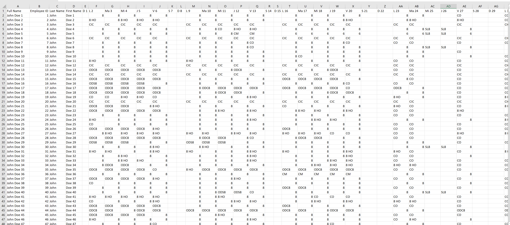
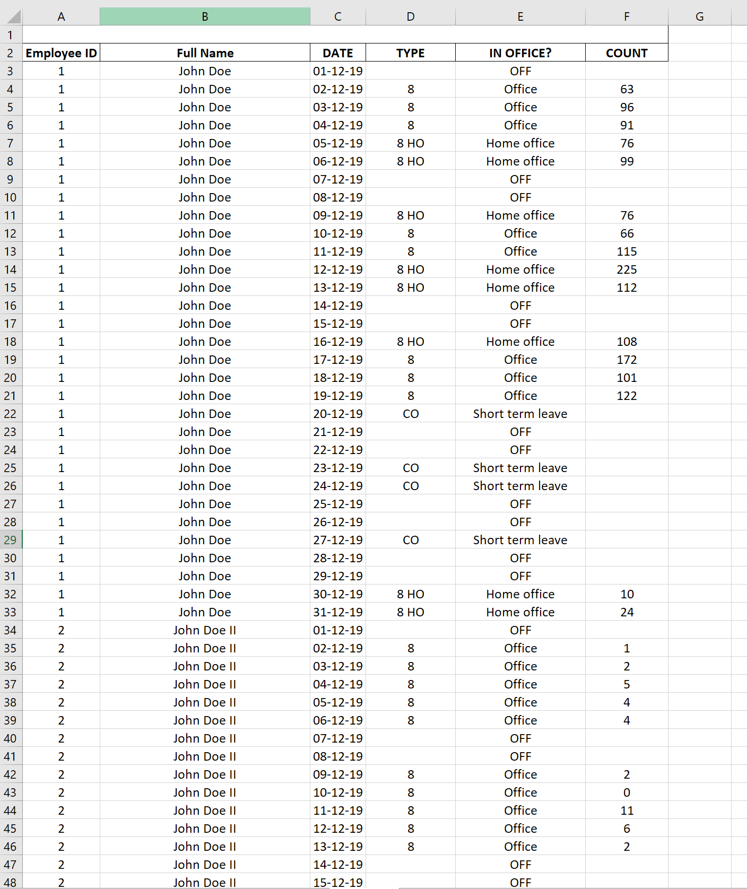
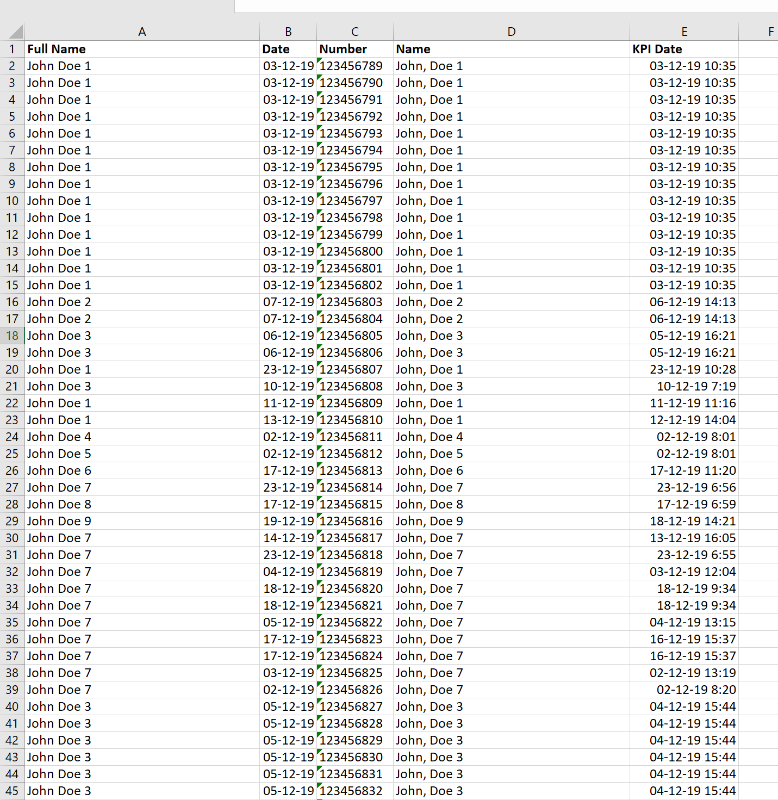
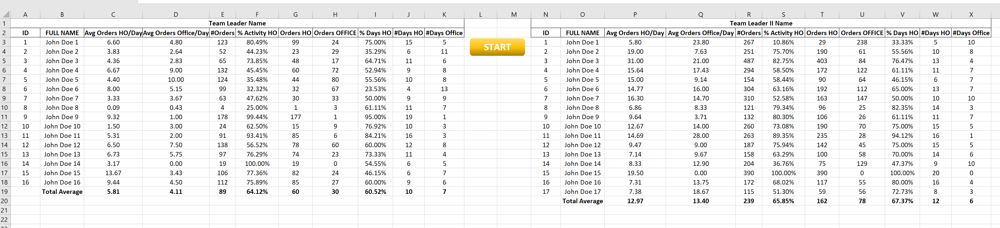

# Work from Home vs. Work from Office

This project is my own take at a Batch Data Pipeline/ETL solution for every business that is dependent on multiple sources of data from different systems that are not connected to each other and don't have a similar/identical format.

### What is the end goal, the output of the script?

The end goal is to build a report showing each employee's activity in the office versus working from home (the activity indicator might be orders, invoices processed, calls, online time or whatever KPI the business wants to check) and draw conclusions based on it, using two source files from two different systems that don't look even remotely the same.

The VBA script imports:
- an Excel source file with employees' schedule for the selected month from company's HR system. This file shows me when was the employee in vacation, leave, off, or working (from home or office). 
 
The file format (in this case) populates data for each employee on one row, and each day of the month is represented on its own column: 30 calendar days for the month means 30 Excel columns to the right. Obviously, different companies and/or HR platforms will have different templates for exporting data. 

In order for me to work with this file (and the next one), I have to concatenate the first and last name of the employees and also (most important) move the calendar days from their horizontal order to a vertical one (transpose). This way, 30 calendar days for example will translate to 30 rows for each employee. (helpful for the countifs formula that will be added later) 

- a source file from company's ERP solution (SAP, ORACLE, etc.). This file shows me the business's activity for the entire month, but it doesn't group the results by employee, team or even calendar day. The objective is to group these hundreds of thousands of rows into coherent data for each employee that can be later interpreted, with some help from the above HR report. 

This file already has the employee names concatenated but it also has a comma between the first and last name, so the script is removing the comma and imports the employees into a VBA dictionary that will help me down the line. 

On top of that, the script also has some neat features that prevent date errors (mm/dd/yyyy vs dd/mm/yyyy) if the source data comes from US and Europe for example, like transforming the date into a DateSerial object in VBA and formatting the Excel cells to text while I'm building the report. 

## The final results
The Excel tables can be seen below, and by having an overview of team's activity in the Excel tables, the business can generate other, more descriptive charts if needed. 

